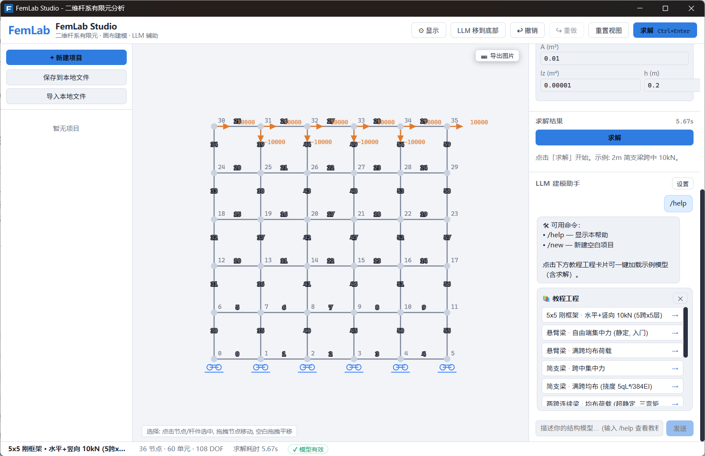

# FemLab Studio

> 二维杆系有限元分析（平面刚架 / 桁架）教学软件 — 画布建模 · 即时求解 · 内力图可视化 · LLM 辅助

FemLab Studio 是一个用于教学和工程实践的二维杆/桁架/刚架有限元程序。支持交互式画布建模、调用求解内核计算位移/内力/反力，并在画布上叠加显示变形图与轴力/剪力/弯矩图。内置 LLM 建模助手，可用自然语言描述结构并自动生成模型。



---

## ✨ 核心特性

| 功能 | 说明 |
|---|---|
| 🎨 画布建模 | 节点 / 杆件 / 荷载 / 约束 拖拽式编辑，网格吸附 |
| ⚡ 即时求解 | 一键求解，位移 / 杆端内力（N·V·M）/ 支座反力 |
| 📊 内力图 | 画布叠加 **轴力图 / 剪力图 / 弯矩图**，颜色区分 |
| 📏 挠度显示 | 变形图 + 节点位移数值标注 |
| 🤖 LLM 助手 | 自然语言描述结构 → 自动生成 JSON 模型（OpenAI 兼容 API）|
| 💾 项目管理 | 本地保存 / 导入导出 JSON 模型文件 |
| ↩️ 撤销重做 | Ctrl+Z / Ctrl+Y，误操作可恢复 |
| 🎛 可调布局 | 三栏拖拽调宽，LLM 面板右侧/底部切换 |

---

## 🚀 快速开始

### 方式一：桌面应用（推荐）

**Windows** 用户可直接运行发布版安装包（NSIS setup.exe），或开发运行：

```powershell
# 1. 构建前端
cd gui_tauri
npm install
npm run build

# 2. 运行 Tauri 应用
cd src-tauri
cargo tauri dev          # 开发模式
cargo tauri build        # 打包安装包 (NSIS)
```

构建产物：
- 调试 exe：`gui_tauri/src-tauri/target/debug/femlab-studio.exe`
- 安装包：`gui_tauri/src-tauri/target/release/bundle/`

### 方式二：命令行求解 (femcli)

```bash
# 构建求解器
cmake -S . -B build
cmake --build build --parallel

# 校验模型
build/bin/femcli.exe validate examples/beam_simple.json

# 求解并输出 JSON 结果
build/bin/femcli.exe solve examples/beam_simple.json -o result.json
```

---

## 🎮 界面速览

- **左侧栏**：项目管理（新建 / 保存本地 / 导入本地）、项目列表
- **中央画布**：结构模型编辑区，右下角切换「原图 / 轴力N / 剪力V / 弯矩M / 挠度」
- **右侧栏**：工具栏（选择/节点/杆件/荷载/约束/删除）、属性面板、求解结果、LLM 助手
- **顶栏**：LLM 位置切换、撤销/重做、重置视图、求解

### 快捷键

| 快捷键 | 功能 |
|---|---|
| `Ctrl+Enter` | 求解 |
| `Ctrl+Z` / `Ctrl+Y` | 撤销 / 重做 |
| `Delete` / `Backspace` | 删除选中对象 |

---

## 🤖 LLM 建模助手

1. 点击右侧「设置」配置 API（OpenAI 兼容：base_url / api_key / model）
2. 用自然语言描述结构，例如：
   > 建立一个 3x3 框架，每个构件 1000mm，每层水平荷载 10kN，截面随机定
3. 助手返回模型 JSON → 点击「应用到画布 + 求解」

模型格式见 [docs/FEM_MODEL_SCHEMA.md](docs/FEM_MODEL_SCHEMA.md)，接口见 [docs/LLM_INTEGRATION.md](docs/LLM_INTEGRATION.md)。

---

## 📦 模型格式

统一使用 JSON 模型（示例见 [examples/](examples/)）：

```json
{
  "schemaVersion": "1.0",
  "title": "2m 简支梁跨中集中力",
  "solver": "builtin",
  "nodes": [
    { "id": 0, "type": "frame", "x": 0.0, "y": 0.0 },
    { "id": 1, "type": "frame", "x": 1.0, "y": 0.0 },
    { "id": 2, "type": "frame", "x": 2.0, "y": 0.0 }
  ],
  "constraints": [
    { "node": 0, "dofs": ["ux", "uy"] },
    { "node": 2, "dofs": ["uy"] }
  ],
  "elements": [
    { "id": 0, "type": "frame", "nodeI": 0, "nodeJ": 1, "section": 0, "material": 0 },
    { "id": 1, "type": "frame", "nodeI": 1, "nodeJ": 2, "section": 0, "material": 0 }
  ],
  "materials": [ { "id": 0, "E": 210000000000.0, "mu": 0.3, "alpha": 0.0 } ],
  "sections": [ { "id": 0, "A": 0.01, "Iz": 1e-5, "height": 0.1 } ],
  "loads": [ { "type": "nodalForce", "direction": "y", "value": -10000.0, "node": 1 } ]
}
```

---

## 🛠 开发

### 项目结构

```
FEM_2d/
├── gui_tauri/                # Tauri 桌面应用
│   ├── src/                  # React 前端
│   │   ├── canvas/           #   画布渲染 (SVG)
│   │   ├── components/       #   界面组件
│   │   ├── store.js          #   zustand 全局状态
│   │   └── ipc.js            #   Tauri IPC 封装
│   └── src-tauri/            # Rust 后端
│       └── src/lib.rs        #   求解/项目/LLM/导入导出 命令
├── barsystem.cpp/h           # FEM 核心求解引擎 (C++11)
├── femcli.cpp                # JSON 命令行求解器
├── CMakeLists.txt            # C++ 构建配置
├── docs/                     # 文档
├── examples/                 # JSON 模型示例
├── tests/                    # C++ 单元测试
├── verify/                   # 求解器验证脚本
└── third_party/              # nlohmann/json 等
```

### 技术栈

| 层 | 技术 |
|---|---|
| 前端 | React 19 · Vite 8 · zustand 5 · SVG |
| 桌面壳 | Tauri v2 (WebView2) |
| 后端 | Rust (IPC) + C++11 (FEM 核心) |
| 测试 | CTest / verify 脚本 / GitHub Actions CI |

### 常用命令

```bash
# 前端构建
cd gui_tauri && npm run build

# 桌面应用调试
cd gui_tauri/src-tauri && cargo tauri dev

# C++ 构建 + 测试
cmake -S . -B build && cmake --build build --parallel
ctest --test-dir build
```

---

## 📚 文档

- [模型 Schema](docs/FEM_MODEL_SCHEMA.md) — JSON 模型字段定义
- [LLM 集成](docs/LLM_INTEGRATION.md) — LLM 建模助手接口
- [命令行用法](docs/guides/USAGE_GUIDE.md) — femcli 详细用法
- [开发者文档](docs/development/DEVELOPMENT.md) — 源码说明

## 📝 版本历史

见 [RELEASE_NOTES.md](RELEASE_NOTES.md)

## 📄 许可证

见仓库 LICENSE 文件

## 🤝 联系我们

- GitHub: https://github.com/HYGUO1993/femlab-studio
- Issues: https://github.com/HYGUO1993/femlab-studio/issues
